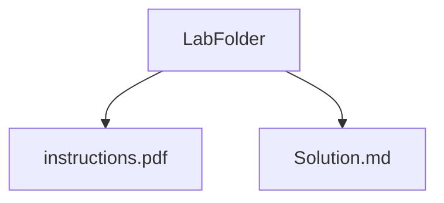

# Labtainers Labs

This repository contains my solved Labtainers cybersecurity labs,
done alongside my coursework to deepen practical understanding.

# Repository Structure

Each lab folder is named after the topic or challenge. Inside each folder:

## Contact 
Feel free to reach out via :

- Email: elfaijahanas@gmail.com 
- LinkedIn : https://www.linkedin.com/in/anaselfaijah/
